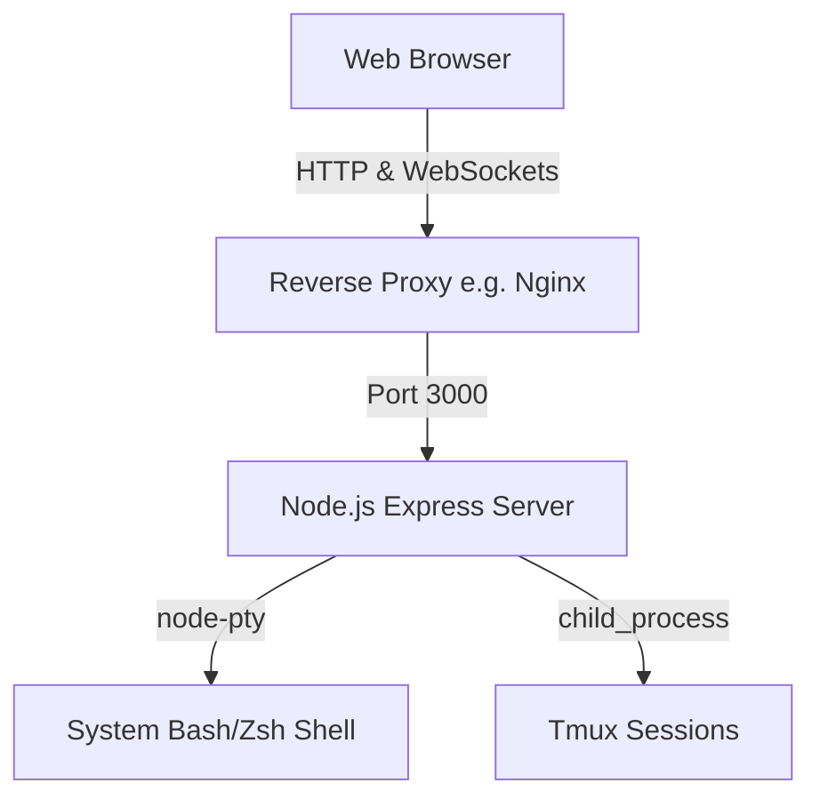

# NexTerm

NexTerm is a modern, lightweight, browser-based web terminal powered by Node.js, `node-pty`, and xterm.js. It allows you to access and manage your server's command-line interfaces remotely and securely via the web.

> **Security Warning:** Never expose this to the public internet without authentication! It grants direct shell access to the underlying server. Ensure this application is only accessible via a secure private network (like Tailscale) or behind a zero-trust proxy (like Cloudflare Access).

## Architecture



## Prerequisites

- **Node.js**: v20 or higher.
- **tmux**: (Optional) Required for persistent terminal sessions.
- **python3**: _(Deprecated after migration to node-pty)_

## Quick Start

1. **Clone the repository:**

   ```bash
   git clone https://github.com/Muhammed2-h/NexTerm.git
   cd NexTerm
   ```

2. **Install dependencies:**

   ```bash
   npm install
   ```

3. **Configure environment:**

   ```bash
   cp .env.example .env.local
   ```

   _Edit `.env.local` to set a secure `SECRET_TOKEN`._

4. **Start the development server:**
   ```bash
   npm run dev
   ```

## Production Deploy

NexTerm includes scripts and configuration out-of-the-box for running safely and reliably.

### Option A: Docker Compose (Recommended)

You can build and run NexTerm as a fully isolated, multi-container app.

```bash
# Add your environment variables:
cp .env.example .env

# Build and start the container:
docker-compose up -d --build
```

> Note: A multi-stage Dockerfile builds the Vite frontend and TS backend automatically.

### Option B: PM2 directly on VPS

If you prefer running NexTerm natively on your server, PM2 provides robust process management.

```bash
# Compile TS to dist/ and Vite build
./build.sh

# Start the application using ecosystems.config.js
pm2 start ecosystem.config.js
```

## Nginx Proxy

A ready-to-use nginx configuration file (`nginx.conf`) is located in the root directory. It exposes the project through an internal Tailscale mesh network instead of an insecure public IPv4 structure.
